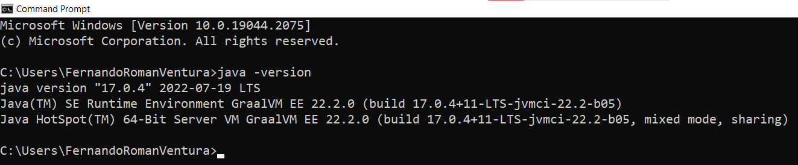

# Introduction to Java #

#### By Fernando Ventura - 10/28/2022 ####

JAVA was developed by James Gosling at Sun Microsystems Inc in the year 1995, later acquired by
Oracle Corporation. It is a simple programming language. Java makes writing, compiling, and
debugging programming easy. It helps to create reusable code and modular programs. Java is a
class-based, object-oriented programming language and is designed to have as few implementation
dependencies as possible. A general-purpose programming language made for developers to write once
run anywhere that is compiled Java code can run on all platforms that support Java. Java
applications are compiled to byte code that can run on any Java Virtual Machine. The syntax of Java
is similar to c/c++. Source: [geeksforgeeks.org](https://www.geeksforgeeks.org/introduction-to-java/)

## Installation ##

For using Java, the first step is to install the Java Virtual Machine (a.k.a. JVM), this is part
of the Java Development Kit (a.k.a. JDK)

### Windows ###

You can use Eclipse's Temurin, go to this [website](https://adoptium.net/es/) and download the
**.msi** installer, installation is straight forward, just click next and next until the JDK is
installed, at the end, reboot your machine.

To verify that the installation went well, open a terminal (Command Prompt), and type:

``` bash 
    java -version
```

You should see something similar to this:


Please note that in my case I have installed [Graalvm JDK](https://www.graalvm.org/), because I need
it for working in more advanced projects.

### MacOS /Linux ###

Use the platform package manager for installing the proper JDK, for example:

MacOS:

```brew
    brew install openjdk@17
```

Debian based, like ubuntu:

```bash 
    sudo apt update && sudo apt install openjdk-17-jdk openjdk-17-jre
```

## Topics covered in this introduction ##

+ Language Syntax (Hello World)
+ Types
    + Primitive
    + Custom (classes)
+ Conditional flow
    + If
    + Else-if
    + else
    + switch
    + while loop
    + do-while loop
    + for loop
    + enhanced for loop (
      see. [Polymorphism.java](./src/main/java/org/striker25/oop/Polymorphism.java)
      at line 24).
+ Object-Oriented Programming (OOP)
    + Inheritance
    + Encapsulation
    + Polymorphism
    + Abstraction. (Using an interface to achieve the same logic as in the Polymorphism class)

## Next steps ##

+ Read the Javadoc during development, so you get a better understanding of Java itself.
  [Javadoc](https://docs.oracle.com/en/java/javase/17/docs/api/).
+ If you have doubts, Google is your best tool, but try to search using English only, at least use
  keywords if you don't know English at all.
+ At the beginning it's ok to copy code from Stack Overflow, but if you do, try to understand the
  piece of code that you are integrating in your project.
+ Watch the same course I followed in the past to learn java:
  [Curso de Java - Píldoras Ínformaticas](https://www.youtube.com/watch?v=U709qY6S9rA&list=PLU8oAlHdN5BktAXdEVCLUYzvDyqRQJ2lk)